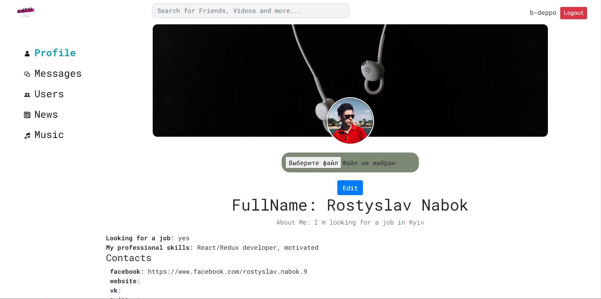
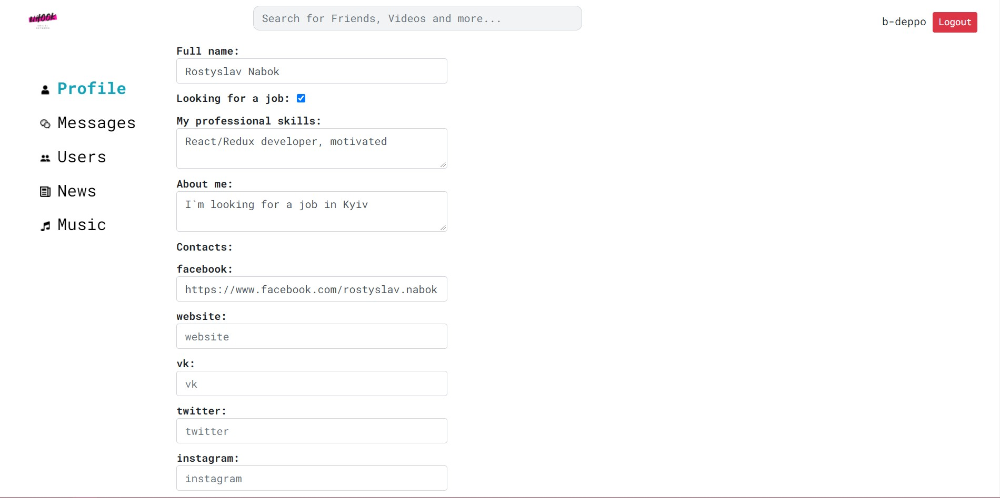
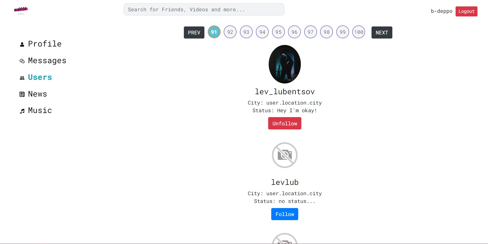
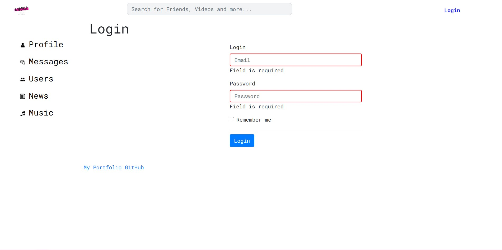

# This is a Social Network UHook

### If you want to test my Social Network you should Login with this test account data
### Email: free@samuraijs.com --- Password: free

## Getting Started 🏁

First, run the development server:

```bash
npm i
npm start
# or
yarn start
```

Open [http://localhost:3000](http://localhost:3000) with your browser to see the result.

## Learn More About Me 🕴️

#### Name: Rostyslav
#### Job: Front-end Developer (React/Redux)
#### My CV app <https://kyiv.codes/>


## About Project 🖥️

#### This is a social network that can do almost everything that Facebook can.

#### Technologies in this project:

  * React
  * JavaScript
  * Redux-thunk
  * Redux
  * TypeScript
  * Bootstrap
  * axios
  * SCSS
  * Redux-Form
  * Reselect
  
  ## Profile 🖥️
  
  
  
  ## Edit Profile Info ⚖️
  
  
 
  ## Users 🧔
  
  
  ## Login 🚩
  
